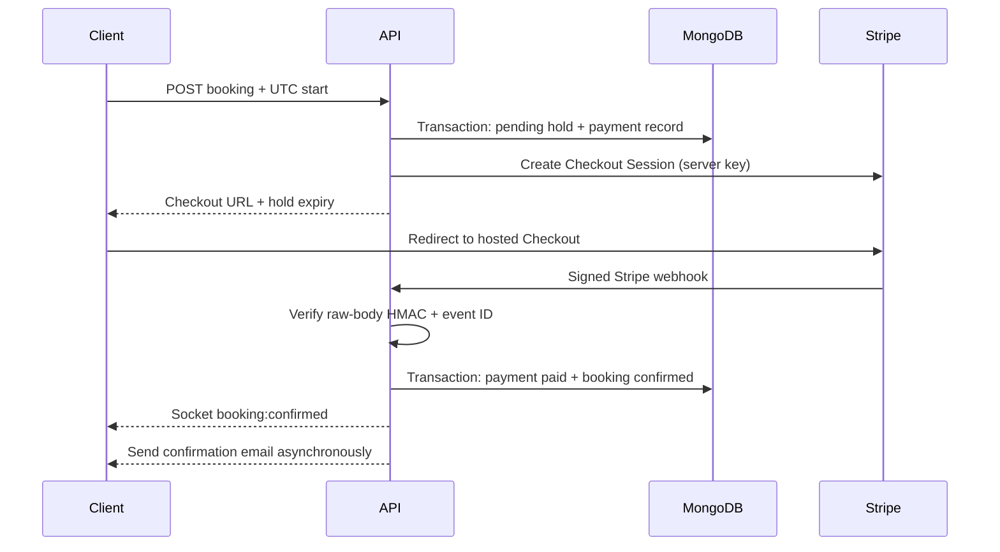

# ConsultBook Live

Real-time appointment booking with customer and admin roles, 10-minute slot holds, Stripe test checkout, and live booking updates. The project uses a `/client` + `/server` monorepo. API business rules live in server services; routes and controllers validate inputs and translate HTTP requests.

## Screenshots

_Placeholder: add customer booking and admin operations screenshots here._

## Stack

- Client: React 18, Vite, TypeScript, Tailwind CSS, React Router, React Hook Form, Zod, Zustand, Axios, Socket.IO client, React Hot Toast.
- Server: Node.js, Express, TypeScript strict mode, MongoDB/Mongoose, Zod, JWT, bcrypt, Socket.IO, node-cron, Helmet, CORS, express-rate-limit, pino, Nodemailer.
- Payments: Stripe-hosted Checkout and signed webhooks. Without keys, the server creates local placeholder sessions to keep browsing and booking flows testable; local placeholders do not capture money.
- Tests: Jest, Supertest, mongodb-memory-server replica set.

## Phase 1: Local foundation

Requirements: Node.js 20+, npm, Docker Desktop (or another MongoDB replica set).

```bash
cp server/.env.example server/.env
cp client/.env.example client/.env
docker compose up -d
npm install
```

The Compose file starts a single MongoDB node and initializes `rs0`, required for Mongo transactions. The example server environment leaves Stripe and SMTP credentials blank, so local booking creates placeholder sessions and sends no email. Replace the example JWT secrets with local random strings; these are not production secrets. From the root, start both development servers:

```bash
npm run dev
```

Client: `http://localhost:5173`. API health: `http://localhost:4000/health`. API docs: `http://localhost:4000/api/docs`.

## Phase 2: Seed and login

```bash
npm run seed --workspace server
```

The script creates one admin, one customer, three services, and Monday-Saturday 10:00-18:00 UTC working hours (Sunday is off). Credentials come from `server/.env`: `ADMIN_EMAIL` / `ADMIN_PASSWORD` and `CUSTOMER_EMAIL` / `CUSTOMER_PASSWORD`. Change the example passwords before using shared environments. The admin account is provisioned by seed, never public registration.

Sign in at the client. Customer registration is available from the same screen. Admins see the operations console; customers see the booking calendar.

## Local testing without real payments

Keep `STRIPE_SECRET_KEY` and `STRIPE_WEBHOOK_SECRET` blank in `server/.env`. This mode makes no payment-provider requests and cannot charge a card.

1. Check API health at `http://localhost:4000/health` and API documentation at `http://localhost:4000/api/docs`.
2. Sign in as the seeded customer using `CUSTOMER_EMAIL` and `CUSTOMER_PASSWORD`. Select a service and a future date that is Monday-Saturday in UTC, then pick an available start time.
3. Select **Continue to payment**. The API creates a PENDING booking and local placeholder order; the UI displays the hold countdown. It does not become confirmed in placeholder mode. Leave it pending to verify that it expires and the slot becomes available again after 10 minutes.
4. Open a second browser profile and sign in with the seeded admin credentials. Check the bookings table and live activity feed while making a fresh booking in the customer profile. The held slot should become unavailable in both clients.
5. Use the customer registration form to test creating another CUSTOMER account. Admin accounts are only created by the seed script.
6. Run automated tests with `npm test --workspace server`. These use a separate in-memory replica set and cover slot edges, two concurrent requests for one start time, webhook signature/idempotency, and socket permissions/broadcasts. They do not use your local database or a payment provider.

For a confirmed-payment, confirmation-email, and chat UI walkthrough without live charges, use Stripe **test-mode** keys as described below and configure its webhook to reach your local server (for example, through Stripe CLI forwarding). Do not put live Stripe keys in this local environment. Blank-key placeholder mode intentionally does not fake a successful payment.

## Phase 3: Payments and verification

This phase is optional for local booking/hold testing. Create a Stripe account, switch to test mode, and set the **test** secret key in `STRIPE_SECRET_KEY`. Install Stripe CLI and forward events to the local webhook:

```bash
stripe listen --forward-to localhost:4000/api/v1/webhooks/stripe
```

Copy the CLI's `whsec_...` signing secret into `STRIPE_WEBHOOK_SECRET`, then restart the server. Subscribe/forward to `checkout.session.completed`, `checkout.session.async_payment_succeeded`, `checkout.session.async_payment_failed`, and `payment_intent.payment_failed`. Never use live keys for local tests. Stripe Checkout is hosted by Stripe, so the client redirects to Checkout rather than collecting card details itself.

Use Stripe's test card `4242 4242 4242 4242`, any future expiry, and any three-digit CVC. Use any valid test billing postal code. No payment details or secret keys belong in client code.

To run checks:

```bash
npm run lint
npm test --workspace server
npm run build
```

The booking integration tests start an in-memory single-node replica set. The first run may download MongoDB binaries and take longer. The slot unit test is pure and needs no database.

## API overview

All API routes use `/api/v1`. Auth: `POST /auth/register`, `/auth/login`, `/auth/refresh`, `/auth/logout`, `GET /auth/me`. Catalog: `GET /services`, admin `POST/PUT /services`, admin `PUT /working-hours`, `GET /slots?serviceId=&date=`. Booking: `POST /bookings`, `GET /bookings/me`, `GET /bookings/:id`, `POST /bookings/:id/cancel`, `GET /bookings/:id/messages`. Admin: `GET /admin/bookings`, `/admin/stats`. Webhook: `POST /webhooks/stripe`.

## Payment flow



## Socket events

| Name                | Direction                             | Payload                                                                  | Receiver                                                |
| ------------------- | ------------------------------------- | ------------------------------------------------------------------------ | ------------------------------------------------------- |
| `room:join`         | Client to server                      | `{ kind: 'slots', serviceId, date }` or `{ kind: 'booking', bookingId }` | Server; booking membership checked in MongoDB           |
| `slot:held`         | Server to clients                     | `{ startTime, bookingId }`                                               | `slots:{serviceId}:{date}`                              |
| `slot:released`     | Server to clients                     | `{ startTime }`                                                          | `slots:{serviceId}:{date}`                              |
| `slot:booked`       | Server to clients                     | `{ startTime }`                                                          | `slots:{serviceId}:{date}`                              |
| `booking:confirmed` | Server to client                      | `{ bookingId }`                                                          | `user:{userId}`                                         |
| `booking:expired`   | Server to client                      | `{ bookingId }`                                                          | `user:{userId}`                                         |
| `admin:new-booking` | Server to admin                       | `{ bookingId, serviceName, startTime }`                                  | `admin`                                                 |
| `chat:message`      | Client to server and server broadcast | `{ bookingId, body }`; broadcast adds `id`, `senderId`, `createdAt`      | Confirmed booking participants in `booking:{bookingId}` |

## Architecture decisions

- **Services own business rules.** Controllers validate and translate requests; Mongoose models describe stored data.
- **UTC is the storage contract.** Working-hour strings and slot dates are interpreted as UTC; the browser renders local time.
- **The database arbitrates a hold race.** `Booking` has a partial unique index on `startTime` for `holdsSlot: true`. The flag remains true for pending and confirmed bookings and is cleared on expiry/cancellation. A Mongo transaction ties a hold to its payment record.
- **Webhook authenticity and retries are separate concerns.** The webhook route uses raw bytes for HMAC verification; a unique provider event ID makes retries idempotent. Payment status only changes from server-side webhook processing.
- **Realtime follows commit.** Socket helpers are behind a tiny service; emitted booking changes follow successful DB writes. Reconnect clients fetch REST state again.
- **Refresh tokens stay in httpOnly cookies.** Access tokens last 15 minutes and are kept in per-tab session storage by the client.

## Known limitations and next steps

- Add a Socket.IO Redis adapter before horizontally scaling the server so room broadcasts reach clients connected to other instances.
- Local placeholder payment sessions are for development only; actual payment confirmation needs configured Stripe test/live keys and signed webhooks.
- Refunds are submitted to Stripe for eligible captured payments; production deployments should add a durable retry/outbox workflow around provider outages.
- Working hours are a UTC weekly schedule; timezone-aware venue schedules, holidays, and daylight-saving policy need a product decision.
- Configure SMTP in a deploy environment to send confirmation emails. Local mode logs/skips email safely.
- Add a durable refresh-token rotation/reuse policy, CSRF strategy for cookie endpoints, and operational metrics before production traffic.

## Deployment notes

- Client: Vercel or Netlify. Set `VITE_API_URL` and `VITE_SOCKET_URL` to the deployed API origin.
- Server: Render or Railway with persistent WebSocket support. Set the server environment variables, allow the client origin, and configure Stripe's webhook URL.
- Database: MongoDB Atlas replica set URI. Transactions require a replica set; standalone MongoDB does not support this booking flow.
- Set `COOKIE_SECURE=true` behind HTTPS, use unique long random JWT secrets, and replace seed credentials. Keep Stripe and SMTP secrets server-side only.
